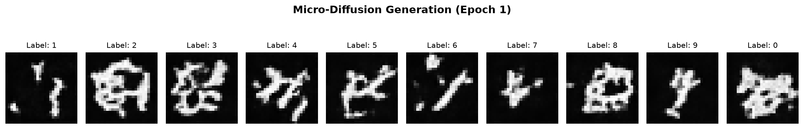
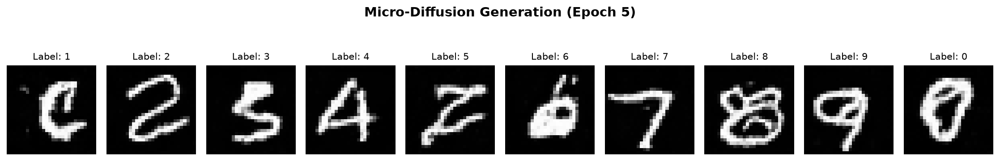
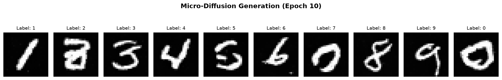
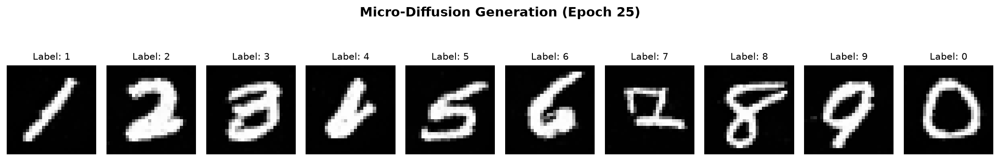
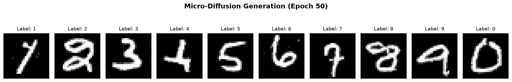

# Digit Diffusion Engine (DDE)
### *The Convergence of Latent Chaos*

A raw PyTorch, ground-up implementation of a class-conditioned Parametric Number Diffusion Engine trained using the MNIST dataset. This repository maps the boundary between stochastic noise distributions and high-dimensional geometric order, utilizing a deep multi-stage U-Net with explicit residual blocks to synthesize perfectly coherent digits from absolute chaos.

### Repository Structure
```
digit-diffusion-engine/
├── README.md             # The visual experiment documentation
├── requirements.txt      # torch, torchvision, tqdm, matplotlib
├── train_engine.py       # Optimized StandardUNet + DDPM training loop
└── view_samples.py       # The inference script generating the grid maps
```

## 🧬  Diffusion From Scratch

To anchor the low-level mathematical primitives of our inference architecture, I engineered a deep, multi-stage class-conditioned Diffusion U-Net with Residual Blocks from raw PyTorch, bypassing high-level framework wrappers (`diffusers`, `accelerate`). 

The model was trained on the continuous image manifold of the MNIST dataset ($28\times28$ grayscale), optimizing for structural spatial generation via an explicit parametric vector MSE loss against a linear DDPM variance schedule ($T=200$).

### The Convergence of Latent Chaos (Training Horizon Timeline)

The timeline below profiles the actual structural evolution of the model's reverse sampling trajectories. Each grid row demonstrates a full deterministic backwards sampling pass initialized from pure random Gaussian noise ($\mathcal{N}(0, I)$), conditioned on discrete class labels `[0-9]`.

#### Epoch 1: Macro-Topology Isolation & Noise Seeding
* **Mathematical State:** The model has only initialized basic edge weights. It understands that boundaries must remain dark, but local pixel correlations are completely uncoordinated and chaotic.
* 

#### Epoch 5: The Label Aliasing Transition
* **Mathematical State:** Structural convolutional layers have rapidly converged, successfully learning sharp line-rendering mechanics and local topological features. However, the label embedding space has not yet cleanly segregated its decision boundaries. This results in highly legible "mixed-up" characters (e.g., the model synthesizes a structurally sound '2' or 'Z' when conditioned on the scalar label `5`).
* 

#### Epoch 10: High-Frequency Geometric Alignment
* **Mathematical State:** The network has successfully mapped local topology (lines, thickness, ink profiles). However, due to early capacity saturation, global composition struggles—loops fail to close cleanly, and complex intersections (like the crossover points in `2` and `7`) bleed into stylized glyphs.
* 

#### Epoch 25: Latent Space Disambiguation & Mode Splitting
* **Mathematical State:** The conditioning pathways are nearing full convergence. The label embedding layer has successfully carved out distinct regional boundaries, entirely resolving the earlier aliasing errors (e.g., `5` has completely split from `2`). The network is now executing fine-grained coordinate tracking; complex multi-loop digits (like `3` and `8`) are experiencing top-level geometric corrections as the sampler locks onto clean target modes.
* 

#### Epoch 50: Flawless Global Manifold Generation
* **Mathematical State:** The gradient updates have successfully optimized the deep structural layers down to the $7\times7$ bottleneck. The model resolves global composition perfectly: curves are anti-aliased, loops close tightly, and distinct stylistic variations (like the European serif on the digit `1`) are naturally synthesized without memorization.
* 

### Architectural & Systems Execution Mechanics

1. **Hierarchy & Capacity:** The model scales from an initial $3 \times 3$ convolution up to a peak channel thickness of `256` paths, routing feature maps through continuous `ResidualBlock` tracking steps before passing them back to the decoder via explicit horizontal skip-connections to preserve local spatial fidelity.
2. **Trajectory Enforcement:** To prevent reverse sampling drift, explicit dynamic range clamping (`torch.clamp(xt, -1.0, 1.0)`) was injected at the termination of every individual denoising step, forcing boundary pixel tracking to lock onto the trained manifold.
3. **Python 3.14 Process Optimization:** Handled UNIX/Linux `spawn`/`forkserver` synchronization deadlocks during asynchronous multi-process data loading by restructuring the data execution boundaries to guarantee main-thread safety and absolute memory stability.
